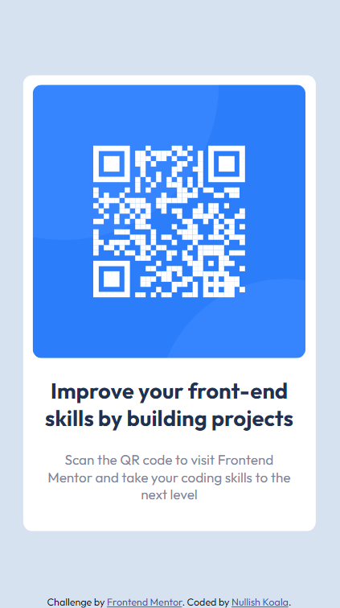

# Frontend Mentor - QR code component solution

This is a solution to the [QR code component challenge on Frontend Mentor](https://www.frontendmentor.io/challenges/qr-code-component-iux_sIO_H).

## Table of contents

- [Overview](#overview)
  - [Screenshot](#screenshot)
  - [Links](#links)
- [My process](#my-process)
  - [Built with](#built-with)
  - [What I learned](#what-i-learned)
  - [Continued development](#continued-development)
  - [Useful resources](#useful-resources)
- [Author](#author)
- [Acknowledgments](#acknowledgments)

## Overview

### Screenshots

### Links

[Solution URL](https://github.com/NullishKoala/Frontend-Mentor/tree/main/development/qr-code-component-main)

## My process

- Decided on the layout of the elements (as flex container for the main content and a footer for the additional info).
- Added the HTML structure of the page to the body element (a div element to work as the flex container and a footer), a link for the suggested Google font.
- Added the HTML elements inside the flex container and the footer, added provided images, copy and links.
- Set the placement of the flex container and the footer using CSS flexbox on the body element.
- Styled the items inside the flexbox container and the footer using CSS flexbox and properties such as color, font family, text alignment, font-weight, background-color.

### Built with

- Semantic HTML5 markup
- CSS custom properties
- CSS Flexbox
- Google font [Outfit](https://fonts.google.com/specimen/Outfit)

### What I learned

I have:

- learned to work with a design provided externally,
- learned to pay attention to detail and to follow provided design instructions,
- reinforced CSS flexbox,
- reinforced CLI commands for creating a repository, pushing a local repository to GitHub, and committing changes to a GitHub repo,
- learned to create a more detailed README file.

What I am especially proud of:

- the time it took me to finish this project. I estimated around 2 hours but managed to finish it in an hour.

### Continued development

It was challenging to work on a project that has a set of requirements as opposed to projects I've created and done from scratch on my own. Getting accustomed to the provided documentation took some extra time. I am looking forward to developing more projects this way since the process resembles an actual developer's workflow.

### Useful resources

- [CSS Flexbox tricks](https://css-tricks.com/snippets/css/a-guide-to-flexbox/) - This
  is a complete guide to CSS flexbox that I like to visit everytime I want to check flexbox rules.

## Author

- Github - [Nullish Koala](https://github.com/NullishKoala)
- Frontend Mentor - [@Nullishkoala](https://www.frontendmentor.io/profile/NullishKoala)
- LinkedIn - [Aneta Kaczmarek](https://www.linkedin.com/in/aneta-m-kaczmarek/)
