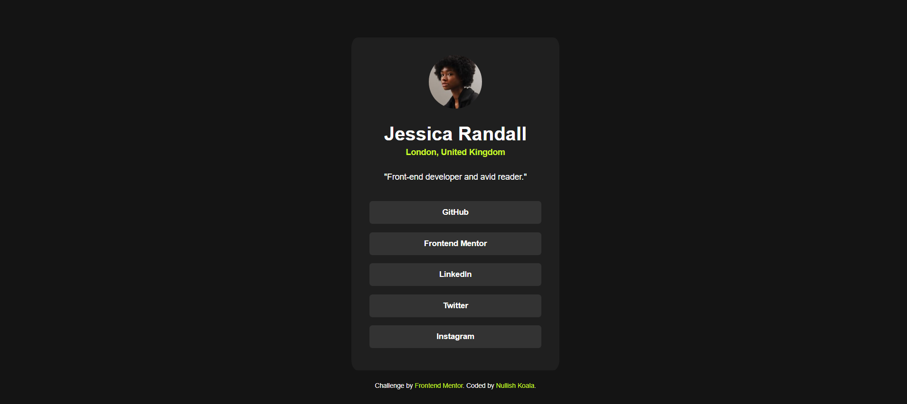
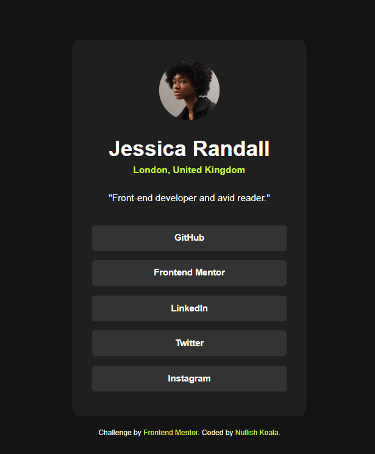

# Frontend Mentor - Social links profile

This is a solution to the [Social links profile coding challenge on Frontend Mentor](https://www.frontendmentor.io/challenges/social-links-profile-UG32l9m6dQ)

## Table of contents

- [Overview](#overview)
  - [Screenshot](#screenshot)
  - [Links](#links)
- [My process](#my-process)
  - [Built with](#built-with)
  - [What I learned](#what-i-learned)
- [Author](#author)

## Overview

### Screenshot

### Links

[Solution URL](https://nullishkoala.github.io/Frontend-Mentor/development/social-links-profile-main/social-links-profile-main.html)

## My process

I have:

1. Read about the project and its specifications.
2. Thought of potential problems and about the general layout.
3. Created HTML file and included all the elements according to the provided screenshots.
4. Linked the external CSS file with HTML file, added all outside files (fonts, images).
5. Created the general layout of the page with flexbox for the main part and position absolute for the footer.
6. First styled the body, defined all colors as variables for future use, then styled the social links container starting from the outside and going inwards from top to bottom to style all all smaller elements.

### Built with

- Semantic HTML5 markup
- CSS custom properties
- Flexbox

### What I learned

I have reinforced:

- CSS flexbox for general and more detailed layout

## Author

- Github - [Nullish Koala](https://github.com/NullishKoala)
- Frontend Mentor - [@Nullishkoala](https://www.frontendmentor.io/profile/NullishKoala)
- LinkedIn - [Aneta Kaczmarek](https://www.linkedin.com/in/aneta-m-kaczmarek/)
